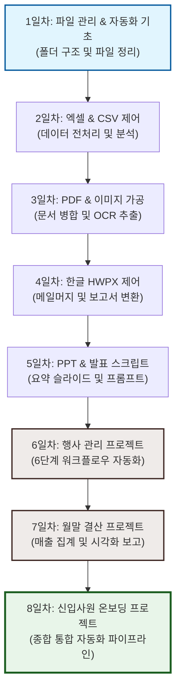

# 📂 AI 사무자동화 1일차 복습 & 로드맵

> **작성일:** 2026년 6월 16일  
> **목적:** 바탕화면 파일/폴더 관리 자동화 기초 학습 및 향후 실습 환경 준비

---

## 🎯 1. 오늘의 목표 (프롬프트)

> [!NOTE]
> **사용자 요청 사항**  
> "바탕화면에 '연습장2' 이라는 폴더를 만들고 그 안에 1월부터 12월까지 폴더를 만드세요!"

---

## ⚙️ 2. 수행한 작업 및 명령어

### 📋 작업 요약
1. **부모 폴더 생성:** 바탕화면에 `연습장2` 폴더를 생성합니다.
2. **자식 폴더 일괄 생성:** `연습장2` 내부 하위에 `1월`부터 `12월`까지 총 12개의 폴더를 생성합니다.
3. **검증:** 생성 결과를 테이블 및 리스트 형태로 확인합니다.

### 💻 실행한 PowerShell 명령어

#### **① 폴더 일괄 생성 스크립트**
```powershell
# 기본 경로 설정
$base = "C:\Users\user\Desktop\연습장2"

# 연습장2 폴더가 없을 경우 자동 생성 (Force)
New-Item -ItemType Directory -Path $base -Force | Out-Null

# 1월부터 12월까지 반복하여 하위 폴더 생성
1..12 | ForEach-Object {
    New-Item -ItemType Directory -Path (Join-Path $base "${_}월") -Force | Out-Null
}

# 생성된 폴더 목록 확인
Get-ChildItem $base | Select-Object Name
```

#### **② 생성 결과 확인 명령어**
```powershell
Get-ChildItem "C:\Users\user\Desktop\연습장2" | Format-Table Name -AutoSize
```

#### **③ 한글 인코딩 및 경로 검증**
```powershell
[System.IO.Directory]::GetDirectories("C:\Users\user\Desktop\연습장2") | ForEach-Object { Split-Path $_ -Leaf }
```

---

## 📊 3. 생성 결과

### 📁 폴더 트리 구조
```text
C:\Users\user\Desktop\연습장2\
├── 1월/
├── 2월/
├── 3월/
├── 4월/
├── 5월/
├── 6월/
├── 7월/
├── 8월/
├── 9월/
├── 10월/
├── 11월/
└── 12월/
```

### 🔍 작업 요약 정보
| 항목 | 상세 내용 |
| :--- | :--- |
| **작업 대상 경로** | `C:\Users\user\Desktop\연습장2` |
| **생성된 폴더 수** | 총 13개 (메인 폴더 1개 + 월별 폴더 12개) |
| **작업 상태** | ✅ 성공 (이상 없음) |

---

## 💡 4. 오늘 배운 핵심 포인트

- **명확한 지시어의 중요성:** AI 가이드 시 **원하는 경로, 폴더명, 개수**를 명확히 지정할 때 정확한 결과가 도출됩니다.
- **PowerShell 자동화 효율성:** `New-Item`과 범위 연산자(`1..12`), 그리고 `ForEach-Object` 반복 루프를 조합하면 다량의 작업을 단 한 줄로 단축할 수 있습니다.
- **예외 처리와 파이프라인:** `-Force` 옵션으로 덮어쓰기/폴더 존재 시 에러 방지 처리를 하고, `| Out-Null`을 사용해 화면 출력을 정돈할 수 있습니다.

---

## 🚀 5. 향후 실습 계획 및 전체 교육 로드맵 (1일차 ~ 8일차)

앞으로 진행할 전체 교육 과정의 실습 로드맵과 각 일차별 세부 학습 내용입니다. 생성한 월별 폴더(`연습장2`)를 시작으로 점진적으로 고도화된 실무 자동화 파이프라인을 구축하게 됩니다.

### 📅 활용 시나리오 로드맵



---

### 📚 일차별 세부 교육 과정 및 실습 링크

| 일차 | 학습 단원 | 실습 대상 폴더 및 주요 실습 내용 |
| :--- | :--- | :--- |
| **1일차** | **파일 관리 및 자동화 기초** | <ul><li>**1차시 (폴더 구조 생성):** 바탕화면에 `연습장2` 폴더를 생성하고 하위에 `1월`~`12월` 폴더 일괄 자동 생성 (완료)</li><li>**2차시 (파일 관리 실습):** [07_파일관리_실습](file:///c:/Users/user/Desktop/ai사무자동화/예제파일/07_파일관리_실습)<br>└ 사진 파일명 일괄 변경 (15장 DSC/IMG/KakaoTalk 이름 정리)<br>└ 혼합 서류함 확장자별 자동 분류 (PDF, 엑셀, PPT, 한글, 이미지, 텍스트)<br>└ 중복 및 대용량 파일 검색 (중복 3쌍, 대용량 2개, 특정 검색어 추출)<br>└ 데이터 백업 및 자동 압축 (엑셀/CSV 백업)<br>└ 빈 폴더 탐색 및 삭제</li></ul> |
| **2일차** | **엑셀 & CSV 전처리 및 분석** | [08_엑셀_CSV_실습](file:///c:/Users/user/Desktop/ai사무자동화/예제파일/08_엑셀_CSV_실습) <ul><li>지역별·등급별 매출/명단 데이터 자동 집계</li><li>누락값(빈칸) 정제 및 중복 데이터 청소</li><li>피벗 테이블 생성 및 시각화 차트 자동 삽입</li><li>설문조사 결과 데이터의 통계적 요약 및 분석</li><li>여러 개의 거래처 정보와 직원 명부 병합 처리</li></ul> |
| **3일차** | **PDF & 이미지 자동 제어** | <ul><li>**1차시 (PDF 실습):** [09_PDF_문서_실습](file:///c:/Users/user/Desktop/ai사무자동화/예제파일/09_PDF_문서_실습)<br>└ 여러 개의 PDF 파일 하나로 합치기 (병합)<br>└ 대용량 PDF 문서 분할 및 특정 범위 페이지 추출<br>└ PDF 문서 내 텍스트 및 표 데이터 파싱<br>└ 스캔/이미지 문서를 서블(Searchable) PDF로 변환</li><li>**2차시 (이미지 실습):** [10_이미지_가공_실습](file:///c:/Users/user/Desktop/ai사무자동화/예제파일/10_이미지_가공_실습)<br>└ 대량 이미지 크기(Resize) 일괄 변환<br>└ 스캔본 문서 OCR 텍스트 분석 및 명함 정보 자동 추출<br>└ 이미지 일괄 워터마크 삽입 및 포맷 변환 (PNG ↔ JPG)</li></ul> |
| **4일차** | **문서 및 보고서 자동화** | [11_한글_문서_실습](file:///c:/Users/user/Desktop/ai사무자동화/예제파일/11_한글_문서_실습) <ul><li>한글(HWPX) 문서 내 텍스트 및 핵심 표 데이터 추출</li><li>메일 머지(Mail Merge)를 활용한 1인 1장 맞춤형 안내문 자동 일괄 생성</li><li>원천 데이터(엑셀 등) 기반 보고서 생성 후 PDF로 일괄 출력 및 저장</li></ul> |
| **5일차** | **발표 자료 제작 자동화** | [12_발표_프롬프트_실습](file:///c:/Users/user/Desktop/ai사무자동화/예제파일/12_발표_프롬프트_실습) <ul><li>텍스트 보고서 자료를 요약하여 PowerPoint(PPT) 슬라이드 초안 자동 생성</li><li>발표 대본(Script) 및 요약 슬라이드 전용 스크립트 작성</li><li>AI 프롬프트 엔지니어링 실습 (좋은 vs 나쁜 프롬프트 비교, 치트시트 활용)</li></ul> |
| **6일차** | **실무 시나리오 (행사 관리)** | [13_행사_시나리오](file:///c:/Users/user/Desktop/ai사무자동화/예제파일/13_행사_시나리오) <ul><li>**행사 관리 통합 프로젝트 (2차시):**<br>명단 정리 ➔ 데이터 집계 ➔ 안내문 제작 ➔ 결산 보고서 ➔ 발표용 PPT ➔ 최종 자료 압축의 실무 6단계를 자동화 흐름으로 연결하여 실습</li></ul> |
| **7일차** | **실무 시나리오 (월말 결산)** | [14_월말결산_시나리오](file:///c:/Users/user/Desktop/ai사무자동화/예제파일/14_월말결산_시나리오) <ul><li>**월말 결산 통합 프로젝트 (1차시):**<br>매출 집계 및 데이터 분석 ➔ 추이 시각화 차트 생성 ➔ 지출 증빙/영수증 정보 추출 ➔ 결산 보고서 작성 ➔ 요약 슬라이드 제작 ➔ 백업 및 메일 전송 준비</li></ul> |
| **8일차** | **종합 실전 프로젝트** | [15_입사첫주_시나리오](file:///c:/Users/user/Desktop/ai사무자동화/예제파일/15_입사첫주_시나리오) <ul><li>**신입사원 온보딩 시나리오 (1차시):**<br>실제 입사 첫 주에 직면할 수 있는 정돈되지 않은 원본 자료(이메일, 사진, 엑셀, 한글 파일)들을 체계적으로 분류 및 가공하고, 최종 보고서 형태까지 도출하는 6단계 종합 자동화 완성</li></ul> |

> [!TIP]
> - 각 실습 링크(예: `[07_파일관리_실습](...)`)를 클릭하면 해당 실습 폴더로 바로 이동할 수 있습니다.
> - 실습 폴더 내부의 `강사용_안내.txt` 파일을 참고하여 각 학습 내용에 맞는 최적의 자동화 스크립트를 작성해 보세요.
