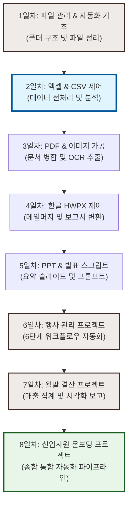

# 📂 AI 사무자동화 2일차 복습 & 로드맵

> **작성일:** 2026년 6월 17일  
> **목적:** 엑셀 & CSV 전처리 및 분석 실습, 파일 관리 심화 및 자동화 파이프라인 구축

---

## 🎯 1. 오늘의 목표 (프롬프트)

> [!NOTE]
> **사용자 요청 사항**  
> 1. "2일차.md 파일을 만들어서 1일차.md 파일처럼 지금부터 하는 작업을 정리해줘" (완료)
> 2. "[07_파일관리_실습\03_중복_검색_대상] 내용이 똑같은 중복 파일을 찾아 표로 정리해줘" (완료)
> 3. "[07_파일관리_실습\04_백업_대상] 폴더에서 엑셀, cvs를 '백업_(오늘날짜)' 폴더에 복사하고 zip으로 압축해줘" (완료)
> 4. "[07_파일관리_실습\05_빈폴더_테스트] 이 폴더 안에 진짜로 빈 폴더가 있는지 확인해줘" (완료)
> 5. "[08_엑셀_CSV_실습\01_회원명단_집계용\회원명단.xlsx] 를 열어서 어떤 항목이 있고 어떤 내용인지 요약해줘" (완료)
> 6. "[08_엑셀_CSV_실습\01_회원명단_집계용\직원명부.xlsx] 이것도 내용을 열어서 요약해줘" (완료)
> 7. "[08_엑셀_CSV_실습\01_회원명단_집계용\회원명단.xlsx] 회원등급별 인원수와 결제금액 합계를 한 표로 만들어서 새 시트에 저장해줘" (완료)
> 8. "결제금액 높은 순서대로 정렬해서 보여줘~저장하지 말고~" (완료)
> 9. "[08_엑셀_CSV_실습\02_일일판매_불량데이터\일일판매_정리필요.csv] 이 파일에서 원본은 그대로 놔두고 빈칸, 중복 행을 제거하고 '일일판매_정리완료.csv'로 저장해줘" (완료)
> 10. "[08_엑셀_CSV_실습\02_일일판매_불량데이터\주문_오류데이터.csv] 이 파일도 같은 방식으로 저장해줘" (완료)
> 11. "일일판매_정리완료.csv 파일을 엑셀(excel) 파일로 변환해서 저장해줘" (완료)
> 12. "[08_엑셀_CSV_실습\03_월별매출_분석용] 폴더에서 월별매출.csv 파일을 가지고 엑셀 파일을 만들어줘. 만든 파일 시트1에 제품별 총 매출과 월평균 매출을 구하고, 시트2에는 행은 월, 열은 제품으로 매출 교차표 만들어줘. 시트3에는 분기별 합계 구해줘." (완료)
> 13. "[08_엑셀_CSV_실습\03_월별매출_분석용\월별매출.csv] 이 파일을 가장 최적화된 방법으로 정리해서 월별매출 정리.excel파일로 정리해줘." (완료)

---

## ⚙️ 2. 수행한 작업 및 명령어

### 📋 작업 요약
1. **2일차 기록 문서 생성:** `2일차.md` 파일을 생성하여 금일 진행되는 작업 및 학습 내용을 체계적으로 정리하기 시작했습니다.
2. **중복 파일 검색 및 정리:** `07_파일관리_실습\03_중복_검색_대상` 폴더 내 모든 파일의 MD5 해시값을 계산하여 내용이 동일한 중복 파일 그룹을 선별하고 표로 정리했습니다.
3. **엑셀 & CSV 파일 백업 및 압축:** `07_파일관리_실습\04_백업_대상` 폴더에서 모든 엑셀(`.xlsx`) 및 CSV(`.csv`) 파일을 필터링하여 오늘 날짜로 명명된 폴더(`백업_20260617`)에 복사하고, 이를 `백업_20260617.zip` 파일로 일괄 압축했습니다.
4. **빈 폴더 탐색:** `07_파일관리_실습\05_빈폴더_테스트` 폴더 하위의 모든 폴더들을 대상으로 자식 항목(파일 및 하위 폴더) 개수가 0개인 진짜 비어있는 폴더를 탐색했습니다.
5. **회원명단 엑셀 요약:** `08_엑셀_CSV_실습\01_회원명단_집계용\회원명단.xlsx` 파일을 파이썬 스크립트로 직접 해석하여 컬럼 구조 및 등록된 총 27명의 회원 데이터를 요약했습니다.
6. **직원명부 엑셀 요약:** `08_엑셀_CSV_실습\01_회원명단_집계용\직원명부.xlsx` 파일을 파이썬 스크립트로 파싱하여 컬럼 구조 및 소속된 총 30명의 직원 데이터를 요약했습니다.
7. **회원등급별 집계 및 새 시트 저장:** `openpyxl` 라이브러리를 사용해 `회원명단.xlsx` 파일의 데이터를 읽어 회원등급별 인원수와 결제금액 합계를 구하고, 이를 `등급별_집계`라는 이름의 새로운 시트에 저장했습니다.
8. **회원 결제금액 정렬 및 조회:** `회원명단.xlsx` 원본 파일에 정렬 결과를 저장하지 않고, 파이썬 메모리 상에서만 결제금액 기준 내림차순(높은 금액 순)으로 회원 정보를 정렬하여 대화 창에 표시했습니다.
9. **일일판매 불량데이터 정제:** `일일판매_정리필요.csv` 파일의 빈칸(누락값)이 있는 행과 중복 행을 찾아 제거하고 깨끗하게 정제된 데이터를 `일일판매_정리완료.csv` 파일로 새로 저장했습니다.
10. **주문 오류데이터 정제:** `주문_오류데이터.csv` 파일에서 빈칸(누락값) 및 중복 데이터를 정제하여 `주문_정리완료.csv` 파일로 저장했습니다.
11. **일일판매 데이터 Excel 변환:** 정제가 완료된 `일일판매_정리완료.csv` 파일을 엑셀 형식(`.xlsx`)으로 변환하여 `일일판매_정리완료.xlsx` 파일로 저장하였습니다. 이 과정에서 가독성을 높이기 위해 첫 행(헤더)을 스타일링하고 각 열의 너비를 자동으로 맞췄습니다.
12. **월별매출 다차원 분석 Excel 생성:** `월별매출.csv` 데이터를 기반으로 3개의 시트(제품별 총/평균 매출 요약, 월-제품 매출 교차표, 분기별 합계)를 구성하고 SUMIF, SUMIFS, SUM 등의 엑셀 수식을 통해 유기적으로 자동 갱신되는 `월별매출_분석.xlsx` 파일을 생성 및 스타일링했습니다. (사용자 요청으로 바탕화면에도 복사본 저장 완료)
13. **월별매출 피벗 및 차트 시각화 Excel 생성:** `월별매출.csv` 데이터를 로드하여 결측치/중복 처리를 수행한 후, 월-제품 매출 교차표(피벗 테이블)와 제품별 매출 트렌드를 파악할 수 있는 **꺾은선 시각화 차트(Line Chart)**가 자동으로 삽입된 `월별매출 정리.xlsx` 파일을 생성했습니다. (사용자 요청으로 바탕화면에도 복사본 저장 완료)

### 💻 실행한 PowerShell 명령어

#### **① 중복 파일 검색 스크립트 (MD5 해시 기준)**
```powershell
# UTF-8 출력 지원 설정
[Console]::OutputEncoding = [System.Text.Encoding]::UTF8

# 대상 디렉토리 경로 지정
$dir = "C:\Users\user\Desktop\ai사무자동화\예제파일\07_파일관리_실습\03_중복_검색_대상"

# 파일들의 해시 계산 후 중복 추출
Get-ChildItem -Path $dir -File | ForEach-Object {
    $hash = (Get-FileHash -Path $_.FullName -Algorithm MD5).Hash
    [PSCustomObject]@{
        Name = $_.Name
        Size = $_.Length
        Hash = $hash
    }
} | Group-Object Hash | Where-Object { $_.Count -gt 1 } | ForEach-Object {
    $_.Group | Format-Table -AutoSize
}
```

#### **② 엑셀 & CSV 백업 및 압축 스크립트**
```powershell
# 대상 디렉토리 설정
$srcDir = "C:\Users\user\Desktop\ai사무자동화\예제파일\07_파일관리_실습\04_백업_대상"
$dateStr = Get-Date -Format "yyyyMMdd"
$backupFolderName = "백업_$dateStr"
$backupDir = Join-Path $srcDir $backupFolderName
$zipFile = Join-Path $srcDir "$backupFolderName.zip"

# 백업 폴더 생성
if (-not (Test-Path $backupDir)) {
    New-Item -ItemType Directory -Path $backupDir -Force | Out-Null
}

# 엑셀(.xlsx) 및 CSV(.csv) 파일만 필터링하여 복사
Get-ChildItem -Path $srcDir -File | Where-Object {
    $_.Extension -match "^\.(xlsx|xls|csv)$"
} | ForEach-Object {
    $destPath = Join-Path $backupDir $_.Name
    Copy-Item -Path $_.FullName -Destination $destPath -Force
}

# 백업 폴더를 zip으로 압축
if (Test-Path $zipFile) {
    Remove-Item -Path $zipFile -Force
}
Compress-Archive -Path $backupDir -DestinationPath $zipFile -Force
```

#### **③ 빈 폴더 탐색 스크립트 (인코딩 무관 동적 경로 탐색)**
```powershell
# 한글 인코딩 깨짐을 원천 방지하기 위해, root 경로 기준 디렉토리 이름의 길이 및 패턴 매칭 사용
$parent = Get-ChildItem -Path $PSScriptRoot -Directory | Where-Object { $_.Name.Length -eq 4 } | Select-Object -First 1
$sub1 = Get-ChildItem -Path $parent.FullName -Directory | Where-Object { $_.Name -like "07_*" } | Select-Object -First 1
$targetDir = Get-ChildItem -Path $sub1.FullName -Directory | Where-Object { $_.Name -like "05_*" } | Select-Object -First 1

Write-Host "Scanning target: $($targetDir.FullName)"
$emptyFolders = Get-ChildItem -Path $targetDir.FullName -Recurse -Directory | ForEach-Object {
    $items = Get-ChildItem -Path $_.FullName -Force
    if ($null -eq $items -or $items.Count -eq 0) {
        Write-Host "Empty folder: $($_.Name)"
    }
}
```

#### **④ 회원등급별 집계 파이썬 스크립트**
```python
import openpyxl
from collections import defaultdict

# 엑셀 파일 로드
filepath = r"C:\Users\user\Desktop\ai사무자동화\예제파일\08_엑셀_CSV_실습\01_회원명단_집계용\회원명단.xlsx"
wb = openpyxl.load_workbook(filepath)
ws = wb.active # 첫 번째 시트

# 데이터 추출
data = []
header = []
for r_idx, row in enumerate(ws.iter_rows(values_only=True)):
    if r_idx == 0:
        header = list(row)
        continue
    if any(cell is not None for cell in row):
        data.append(row)
        
grade_col_idx = header.index("회원등급")
payment_col_idx = header.index("결제금액")

# 등급별 인원 및 결제금액 집계
grade_stats = defaultdict(lambda: {"count": 0, "sum_payment": 0.0})
for row in data:
    grade = row[grade_col_idx]
    payment = row[payment_col_idx]
    payment_val = float(payment) if payment else 0
    grade_stats[grade]["count"] += 1
    grade_stats[grade]["sum_payment"] += payment_val
    
# 새 집계 시트 생성 (기존 시트가 있다면 삭제 후 재생성)
agg_sheet_name = "등급별_집계"
if agg_sheet_name in wb.sheetnames:
    del wb[agg_sheet_name]
new_ws = wb.create_sheet(title=agg_sheet_name)

# 헤더 및 내용 입력
new_ws.append(["회원등급", "인원수", "결제금액 합계"])
for grade, stats in sorted(grade_stats.items()):
    new_ws.append([grade, stats["count"], stats["sum_payment"]])
    
# 헤더 스타일링 (볼드 및 중앙 정렬)
for cell in new_ws[1]:
    cell.font = openpyxl.styles.Font(bold=True)
    cell.alignment = openpyxl.styles.Alignment(horizontal="center")
    
wb.save(filepath)
wb.close()
```

#### **⑤ 일일판매 데이터 정제 파이썬 스크립트**
```python
import csv

# 파일 경로 설정
input_path = r"C:\Users\user\Desktop\ai사무자동화\예제파일\08_엑셀_CSV_실습\02_일일판매_불량데이터\일일판매_정리필요.csv"
output_path = r"C:\Users\user\Desktop\ai사무자동화\예제파일\08_엑셀_CSV_실습\02_일일판매_불량데이터\일일판매_정리완료.csv"

# UTF-8 인코딩으로 CSV 파일 읽기 및 쓰기
with open(input_path, mode='r', encoding='utf-8') as f:
    reader = csv.reader(f)
    header = next(reader)
    
    seen = set()
    cleaned_rows = []
    
    for row in reader:
        # 1. 완전히 비어있거나 누락된 열(빈칸)이 있는 행 제외
        if not row or any(cell.strip() == '' for cell in row):
            continue
            
        # 2. 중복 데이터 제외
        row_tuple = tuple(cell.strip() for cell in row)
        if row_tuple in seen:
            continue
            
        seen.add(row_tuple)
        cleaned_rows.append(row)

# 정리완료 파일로 저장
with open(output_path, mode='w', encoding='utf-8', newline='') as f:
    writer = csv.writer(f)
    writer.writerow(header)
    writer.writerows(cleaned_rows)
```

#### **⑥ 주문 오류데이터 정제 파이썬 스크립트**
```python
import csv

# 파일 경로 설정
input_path = r"C:\Users\user\Desktop\ai사무자동화\예제파일\08_엑셀_CSV_실습\02_일일판매_불량데이터\주문_오류데이터.csv"
output_path = r"C:\Users\user\Desktop\ai사무자동화\예제파일\08_엑셀_CSV_실습\02_일일판매_불량데이터\주문_정리완료.csv"

# UTF-8 인코딩으로 CSV 파일 읽기 및 쓰기
with open(input_path, mode='r', encoding='utf-8') as f:
    reader = csv.reader(f)
    header = next(reader)
    
    seen = set()
    cleaned_rows = []
    
    for row in reader:
        # 1. 완전히 비어있거나 누락된 열(빈칸)이 있는 행 제외
        if not row or any(cell.strip() == '' for cell in row):
            continue
            
        # 2. 중복 데이터 제외
        row_tuple = tuple(cell.strip() for cell in row)
        if row_tuple in seen:
            continue
            
        seen.add(row_tuple)
        cleaned_rows.append(row)

# 정리완료 파일로 저장
with open(output_path, mode='w', encoding='utf-8', newline='') as f:
    writer = csv.writer(f)
    writer.writerow(header)
    writer.writerows(cleaned_rows)
```

#### **⑦ 일일판매 정리완료 Excel 변환 스크립트**
```python
import csv
import openpyxl

csv_path = r"C:\Users\user\Desktop\ai사무자동화\예제파일\08_엑셀_CSV_실습\02_일일판매_불량데이터\일일판매_정리완료.csv"
xlsx_path = r"C:\Users\user\Desktop\ai사무자동화\예제파일\08_엑셀_CSV_실습\02_일일판매_불량데이터\일일판매_정리완료.xlsx"

# 워크북 생성 및 초기화
wb = openpyxl.Workbook()
ws = wb.active
ws.title = "일일판매_정리완료"

# CSV 파일 로드 및 Excel 변환
with open(csv_path, mode='r', encoding='utf-8') as f:
    reader = csv.reader(f)
    for r_idx, row in enumerate(reader, start=1):
        for c_idx, val in enumerate(row, start=1):
            if r_idx == 1:
                ws.cell(row=r_idx, column=c_idx, value=val)
            else:
                # 숫자형 변환 처리
                if val.isdigit():
                    ws.cell(row=r_idx, column=c_idx, value=int(val))
                else:
                    try:
                        ws.cell(row=r_idx, column=c_idx, value=float(val))
                    except ValueError:
                        ws.cell(row=r_idx, column=c_idx, value=val)

# 열 너비 자동 맞춤
for col in ws.columns:
    max_len = max(len(str(cell.value or '')) for cell in col)
    col_letter = openpyxl.utils.get_column_letter(col[0].column)
    ws.column_dimensions[col_letter].width = max(max_len + 3, 10)

# 헤더 스타일 설정 (볼드, 배경색, 중앙 정렬)
header_font = openpyxl.styles.Font(bold=True)
header_fill = openpyxl.styles.PatternFill(start_color="E0E0E0", end_color="E0E0E0", fill_type="solid")
for cell in ws[1]:
    cell.font = header_font
    cell.fill = header_fill
    cell.alignment = openpyxl.styles.Alignment(horizontal="center")

wb.save(xlsx_path)
wb.close()
```

#### **⑧ 월별매출 다차원 분석 및 엑셀 생성 스크립트**
```python
import csv
import openpyxl
from openpyxl.styles import Font, PatternFill, Alignment, Border, Side
from openpyxl.utils import get_column_letter

csv_path = r"C:\Users\user\Desktop\ai사무자동화\예제파일\08_엑셀_CSV_실습\03_월별매출_분석용\월별매출.csv"
xlsx_path = r"C:\Users\user\Desktop\ai사무자동화\예제파일\08_엑셀_CSV_실습\03_월별매출_분석용\월별매출_분석.xlsx"

# CSV 데이터 로드
raw_rows = []
with open(csv_path, mode='r', encoding='utf-8') as f:
    reader = csv.reader(f)
    header = next(reader)
    for row in reader:
        if row:
            raw_rows.append([row[0].strip(), row[1].strip(), int(row[2].strip()), int(row[3].strip())])

wb = openpyxl.Workbook()

# 스타일 객체 정의
font_name = "맑은 고딕"
font_regular = Font(name=font_name, size=10)
font_bold = Font(name=font_name, size=10, bold=True)
font_header = Font(name=font_name, size=10, bold=True, color="FFFFFF")

fill_header = PatternFill(start_color="1F4E78", end_color="1F4E78", fill_type="solid") # Dark Navy
fill_total = PatternFill(start_color="D9E1F2", end_color="D9E1F2", fill_type="solid") # Light Blue-gray
fill_zebra = PatternFill(start_color="F9FBFD", end_color="F9FBFD", fill_type="solid") # Zebra line fill

thin_border = Side(border_style="thin", color="D9D9D9")
border_cell = Border(left=thin_border, right=thin_border, top=thin_border, bottom=thin_border)
border_total = Border(left=thin_border, right=thin_border, top=Side(border_style="thin", color="000000"), bottom=Side(border_style="double", color="000000"))

align_center = Alignment(horizontal="center", vertical="center")
align_right = Alignment(horizontal="right", vertical="center")

# --- 시트1: 제품별_매출_요약 ---
ws1 = wb.active
ws1.title = "제품별_매출_요약"
ws1.views.sheetView[0].showGridLines = True

# 요약 테이블 헤더
ws1.cell(row=2, column=2, value="제품").font = font_header
ws1.cell(row=2, column=2).fill = fill_header
ws1.cell(row=2, column=2).alignment = align_center

ws1.cell(row=2, column=3, value="총 매출액").font = font_header
ws1.cell(row=2, column=3).fill = fill_header
ws1.cell(row=2, column=3).alignment = align_center

ws1.cell(row=2, column=4, value="월평균 매출액").font = font_header
ws1.cell(row=2, column=4).fill = fill_header
ws1.cell(row=2, column=4).alignment = align_center

products = ["베이직", "프리미엄", "엔터프라이즈"]
for i, prod in enumerate(products, start=3):
    ws1.cell(row=i, column=2, value=prod).font = font_bold
    ws1.cell(row=i, column=2).alignment = align_center
    ws1.cell(row=i, column=2).border = border_cell
    
    # SUMIF 수식 적용
    ws1.cell(row=i, column=3, value=f"=SUMIF(G$3:G$38, B{i}, I$3:I$38)").font = font_regular
    ws1.cell(row=i, column=3).number_format = '#,##0"원"'
    ws1.cell(row=i, column=3).alignment = align_right
    ws1.cell(row=i, column=3).border = border_cell
    
    # AVERAGEIF 수식 적용
    ws1.cell(row=i, column=4, value=f"=AVERAGEIF(G$3:G$38, B{i}, I$3:I$38)").font = font_regular
    ws1.cell(row=i, column=4).number_format = '#,##0"원"'
    ws1.cell(row=i, column=4).alignment = align_right
    ws1.cell(row=i, column=4).border = border_cell

# 합계 및 평균 행
ws1.cell(row=6, column=2, value="합계 / 평균").font = font_bold
ws1.cell(row=6, column=2).fill = fill_total
ws1.cell(row=6, column=2).alignment = align_center
ws1.cell(row=6, column=2).border = border_total

ws1.cell(row=6, column=3, value="=SUM(C3:C5)").font = font_bold
ws1.cell(row=6, column=3).fill = fill_total
ws1.cell(row=6, column=3).number_format = '#,##0"원"'
ws1.cell(row=6, column=3).alignment = align_right
ws1.cell(row=6, column=3).border = border_total

ws1.cell(row=6, column=4, value="=AVERAGE(D3:D5)").font = font_bold
ws1.cell(row=6, column=4).fill = fill_total
ws1.cell(row=6, column=4).number_format = '#,##0"원"'
ws1.cell(row=6, column=4).alignment = align_right
ws1.cell(row=6, column=4).border = border_total

# 원본 데이터 테이블 (F2:I38)
headers_raw = ["월", "제품", "판매수량", "매출액"]
for c_idx, h_val in enumerate(headers_raw, start=6):
    cell = ws1.cell(row=2, column=c_idx, value=h_val)
    cell.font = font_header
    cell.fill = fill_header
    cell.alignment = align_center
    
for r_idx, row_data in enumerate(raw_rows, start=3):
    for c_idx, val in enumerate(row_data, start=6):
        cell = ws1.cell(row=r_idx, column=c_idx, value=val)
        cell.font = font_regular
        cell.border = border_cell
        if r_idx % 2 == 0:
            cell.fill = fill_zebra
        
        if c_idx in [6, 7]:
            cell.alignment = align_center
        elif c_idx == 8:
            cell.alignment = align_right
            cell.number_format = '#,##0'
        elif c_idx == 9:
            cell.alignment = align_right
            cell.number_format = '#,##0"원"'

# --- 시트2: 매출_교차표 ---
ws2 = wb.create_sheet(title="매출_교차표")
ws2.views.sheetView[0].showGridLines = True

ws2.cell(row=2, column=2, value="월 / 제품").font = font_header
ws2.cell(row=2, column=2).fill = fill_header
ws2.cell(row=2, column=2).alignment = align_center
ws2.cell(row=2, column=2).border = border_cell

for c_idx, prod in enumerate(products, start=3):
    cell = ws2.cell(row=2, column=c_idx, value=prod)
    cell.font = font_header
    cell.fill = fill_header
    cell.alignment = align_center
    cell.border = border_cell
    
ws2.cell(row=2, column=6, value="합계").font = font_header
ws2.cell(row=2, column=6).fill = fill_header
ws2.cell(row=2, column=6).alignment = align_center
ws2.cell(row=2, column=6).border = border_cell

for m_idx in range(1, 13):
    row_num = m_idx + 2
    ws2.cell(row=row_num, column=2, value=f"{m_idx}월").font = font_bold
    ws2.cell(row=row_num, column=2).alignment = align_center
    ws2.cell(row=row_num, column=2).border = border_cell
    if row_num % 2 == 0:
        ws2.cell(row=row_num, column=2).fill = fill_zebra
        
    for c_idx, prod in enumerate(products, start=3):
        val_cell = ws2.cell(row=row_num, column=c_idx)
        val_cell.value = f"=SUMIFS(제품별_매출_요약!$I$3:$I$38, 제품별_매출_요약!$F$3:$F$38, $B{row_num}, 제품별_매출_요약!$G$3:$G$38, C$2)"
        val_cell.font = font_regular
        val_cell.number_format = '#,##0"원"'
        val_cell.alignment = align_right
        val_cell.border = border_cell
        if row_num % 2 == 0:
            val_cell.fill = fill_zebra
            
    tot_cell = ws2.cell(row=row_num, column=6)
    tot_cell.value = f"=SUM(C{row_num}:E{row_num})"
    tot_cell.font = font_bold
    tot_cell.number_format = '#,##0"원"'
    tot_cell.alignment = align_right
    tot_cell.border = border_cell
    if row_num % 2 == 0:
        tot_cell.fill = fill_zebra

ws2.cell(row=15, column=2, value="합계").font = font_bold
ws2.cell(row=15, column=2).fill = fill_total
ws2.cell(row=15, column=2).alignment = align_center
ws2.cell(row=15, column=2).border = border_total

for c_idx in range(3, 7):
    col_letter = get_column_letter(c_idx)
    tot_cell = ws2.cell(row=15, column=c_idx)
    tot_cell.value = f"=SUM({col_letter}3:{col_letter}14)"
    tot_cell.font = font_bold
    tot_cell.fill = fill_total
    tot_cell.number_format = '#,##0"원"'
    tot_cell.alignment = align_right
    tot_cell.border = border_total

# --- 시트3: 분기별_매출_합계 ---
ws3 = wb.create_sheet(title="분기별_매출_합계")
ws3.views.sheetView[0].showGridLines = True

ws3.cell(row=2, column=2, value="분기").font = font_header
ws3.cell(row=2, column=2).fill = fill_header
ws3.cell(row=2, column=2).alignment = align_center
ws3.cell(row=2, column=2).border = border_cell

for c_idx, prod in enumerate(products, start=3):
    cell = ws3.cell(row=2, column=c_idx, value=prod)
    cell.font = font_header
    cell.fill = fill_header
    cell.alignment = align_center
    cell.border = border_cell
    
ws3.cell(row=2, column=6, value="합계").font = font_header
ws3.cell(row=2, column=6).fill = fill_header
ws3.cell(row=2, column=6).alignment = align_center
ws3.cell(row=2, column=6).border = border_cell

quarters = [
    ("1분기 (1월~3월)", 3, 5),
    ("2분기 (4월~6월)", 6, 8),
    ("3분기 (7월~9월)", 9, 11),
    ("4분기 (10월~12월)", 12, 14)
]

for q_idx, (q_name, start_row, end_row) in enumerate(quarters, start=3):
    ws3.cell(row=q_idx, column=2, value=q_name).font = font_bold
    ws3.cell(row=q_idx, column=2).alignment = align_center
    ws3.cell(row=q_idx, column=2).border = border_cell
    if q_idx % 2 == 0:
        ws3.cell(row=q_idx, column=2).fill = fill_zebra
        
    for c_idx in range(3, 6):
        col_letter = get_column_letter(c_idx)
        val_cell = ws3.cell(row=q_idx, column=c_idx)
        val_cell.value = f"=SUM(매출_교차표!{col_letter}{start_row}:{col_letter}{end_row})"
        val_cell.font = font_regular
        val_cell.number_format = '#,##0"원"'
        val_cell.alignment = align_right
        val_cell.border = border_cell
        if q_idx % 2 == 0:
            val_cell.fill = fill_zebra
            
    tot_cell = ws3.cell(row=q_idx, column=6)
    tot_cell.value = f"=SUM(C{q_idx}:E{q_idx})"
    tot_cell.font = font_bold
    tot_cell.number_format = '#,##0"원"'
    tot_cell.alignment = align_right
    tot_cell.border = border_cell
    if q_idx % 2 == 0:
        tot_cell.fill = fill_zebra

ws3.cell(row=7, column=2, value="합계").font = font_bold
ws3.cell(row=7, column=2).fill = fill_total
ws3.cell(row=7, column=2).alignment = align_center
ws3.cell(row=7, column=2).border = border_total

for c_idx in range(3, 7):
    col_letter = get_column_letter(c_idx)
    tot_cell = ws3.cell(row=7, column=c_idx)
    tot_cell.value = f"=SUM({col_letter}3:{col_letter}6)"
    tot_cell.font = font_bold
    tot_cell.fill = fill_total
    tot_cell.number_format = '#,##0"원"'
    tot_cell.alignment = align_right
    tot_cell.border = border_total

# 열 너비 조정
for ws in [ws1, ws2, ws3]:
    for col in ws.columns:
        max_len = 0
        col_letter = get_column_letter(col[0].column)
        has_val = False
        for cell in col:
            val_str = str(cell.value or '')
            if cell.value is not None:
                has_val = True
            if val_str.startswith('='):
                val_str = "1,000,000,000원"
            if len(val_str) > max_len:
                max_len = len(val_str)
        if has_val:
            ws.column_dimensions[col_letter].width = max(max_len + 4, 12)
        else:
            ws.column_dimensions[col_letter].width = 3

wb.save(xlsx_path)
wb.close()
```

#### **⑨ 월별매출 피벗 및 차트 시각화 Excel 생성 스크립트**
```python
import csv
import openpyxl
from openpyxl.styles import Font, PatternFill, Alignment, Border, Side
from openpyxl.utils import get_column_letter
from openpyxl.chart import LineChart, Reference

csv_path = r"C:\Users\user\Desktop\ai사무자동화\예제파일\08_엑셀_CSV_실습\03_월별매출_분석용\월별매출.csv"
xlsx_path = r"C:\Users\user\Desktop\ai사무자동화\예제파일\08_엑셀_CSV_실습\03_월별매출_분석용\월별매출 정리.xlsx"

# 데이터 로드 및 정제 (누락값/중복 행 정제 처리)
raw_rows = []
seen = set()
with open(csv_path, mode='r', encoding='utf-8') as f:
    reader = csv.reader(f)
    header = next(reader)
    for row in reader:
        if not row or all(cell.strip() == '' for cell in row):
            continue
        stripped_row = [cell.strip() for cell in row]
        if any(cell == '' for cell in stripped_row):
            continue
        row_tuple = tuple(stripped_row)
        if row_tuple in seen:
            continue
        seen.add(row_tuple)
        raw_rows.append([stripped_row[0], stripped_row[1], int(stripped_row[2]), int(stripped_row[3])])

wb = openpyxl.Workbook()

# 스타일 정의
font_name = "맑은 고딕"
font_regular = Font(name=font_name, size=10)
font_bold = Font(name=font_name, size=10, bold=True)
font_header = Font(name=font_name, size=10, bold=True, color="FFFFFF")

fill_header = PatternFill(start_color="1F4E78", end_color="1F4E78", fill_type="solid") # Dark Navy
fill_total = PatternFill(start_color="D9E1F2", end_color="D9E1F2", fill_type="solid") # Soft Blue-gray
fill_zebra = PatternFill(start_color="F9FBFD", end_color="F9FBFD", fill_type="solid")

thin_border = Side(border_style="thin", color="D9D9D9")
border_cell = Border(left=thin_border, right=thin_border, top=thin_border, bottom=thin_border)
border_total = Border(left=thin_border, right=thin_border, top=Side(border_style="thin", color="000000"), bottom=Side(border_style="double", color="000000"))

align_center = Alignment(horizontal="center", vertical="center")
align_right = Alignment(horizontal="right", vertical="center")

ws = wb.active
ws.title = "월별매출_종합분석"
ws.views.sheetView[0].showGridLines = True

# 피벗 테이블 헤더 (B2:F15)
ws.cell(row=2, column=2, value="월 / 제품").font = font_header
ws.cell(row=2, column=2).fill = fill_header
ws.cell(row=2, column=2).alignment = align_center
ws.cell(row=2, column=2).border = border_cell

products = ["베이직", "프리미엄", "엔터프라이즈"]
for c_idx, prod in enumerate(products, start=3):
    cell = ws.cell(row=2, column=c_idx, value=prod)
    cell.font = font_header
    cell.fill = fill_header
    cell.alignment = align_center
    cell.border = border_cell
    
ws.cell(row=2, column=6, value="합계").font = font_header
ws.cell(row=2, column=6).fill = fill_header
ws.cell(row=2, column=6).alignment = align_center
ws.cell(row=2, column=6).border = border_cell

# 월별 데이터 채우기 (SUMIFS 연동)
for m_idx in range(1, 13):
    row_num = m_idx + 2
    ws.cell(row=row_num, column=2, value=f"{m_idx}월").font = font_bold
    ws.cell(row=row_num, column=2).alignment = align_center
    ws.cell(row=row_num, column=2).border = border_cell
    if row_num % 2 == 0:
        ws.cell(row=row_num, column=2).fill = fill_zebra
        
    for c_idx, prod in enumerate(products, start=3):
        val_cell = ws.cell(row=row_num, column=c_idx)
        val_cell.value = f"=SUMIFS(K$3:K$38, H$3:H$38, $B{row_num}, I$3:I$38, C$2)"
        val_cell.font = font_regular
        val_cell.number_format = '#,##0"원"'
        val_cell.alignment = align_right
        val_cell.border = border_cell
        if row_num % 2 == 0:
            val_cell.fill = fill_zebra
            
    tot_cell = ws.cell(row=row_num, column=6)
    tot_cell.value = f"=SUM(C{row_num}:E{row_num})"
    tot_cell.font = font_bold
    tot_cell.number_format = '#,##0"원"'
    tot_cell.alignment = align_right
    tot_cell.border = border_cell
    if row_num % 2 == 0:
        tot_cell.fill = fill_zebra

# 합계 행 (Row 15)
ws.cell(row=15, column=2, value="합계").font = font_bold
ws.cell(row=15, column=2).fill = fill_total
ws.cell(row=15, column=2).alignment = align_center
ws.cell(row=15, column=2).border = border_total

for c_idx in range(3, 7):
    col_letter = get_column_letter(c_idx)
    tot_cell = ws.cell(row=15, column=c_idx)
    tot_cell.value = f"=SUM({col_letter}3:{col_letter}14)"
    tot_cell.font = font_bold
    tot_cell.fill = fill_total
    tot_cell.number_format = '#,##0"원"'
    tot_cell.alignment = align_right
    tot_cell.border = border_total
    
# 원본 데이터 배치 (H2:K38)
headers_raw = ["월", "제품", "판매수량", "매출액"]
for c_idx, h_val in enumerate(headers_raw, start=8):
    cell = ws.cell(row=2, column=c_idx, value=h_val)
    cell.font = font_header
    cell.fill = fill_header
    cell.alignment = align_center
    cell.border = border_cell
    
for r_idx, row_data in enumerate(raw_rows, start=3):
    for c_idx, val in enumerate(row_data, start=8):
        cell = ws.cell(row=r_idx, column=c_idx, value=val)
        cell.font = font_regular
        cell.border = border_cell
        if r_idx % 2 == 0:
            cell.fill = fill_zebra
            
        if c_idx in [8, 9]:
            cell.alignment = align_center
        elif c_idx == 10:
            cell.alignment = align_right
            cell.number_format = '#,##0'
        elif c_idx == 11:
            cell.alignment = align_right
            cell.number_format = '#,##0"원"'

# 제품별 월 매출액 추이 꺾은선 차트 삽입
chart = LineChart()
chart.title = "제품별 월 매출액 추이"
chart.style = 13
chart.y_axis.title = "매출액 (원)"
chart.x_axis.title = "월"
chart.width = 17
chart.height = 10

data_ref = Reference(ws, min_col=3, min_row=2, max_col=5, max_row=14)
cats_ref = Reference(ws, min_col=2, min_row=3, max_row=14)

chart.add_data(data_ref, titles_from_data=True)
chart.set_categories(cats_ref)

for series in chart.series:
    series.graphicalProperties.line.width = 25000

ws.add_chart(chart, "B17")

# 열 너비 자동 맞춤
for col in ws.columns:
    max_len = 0
    col_letter = get_column_letter(col[0].column)
    has_val = False
    for cell in col:
        val_str = str(cell.value or '')
        if cell.value is not None:
            has_val = True
        if val_str.startswith('='):
            val_str = "1,000,000,000원"
        if len(val_str) > max_len:
            max_len = len(val_str)
    if has_val:
        ws.column_dimensions[col_letter].width = max(max_len + 4, 12)
    else:
        ws.column_dimensions[col_letter].width = 3

wb.save(xlsx_path)
wb.close()
```

---

## 📊 3. 작업 수행 결과

### 🔍 ① 중복 파일 분석 결과
내용(해시값)과 파일 크기가 완전히 일치하는 파일들을 그룹으로 매핑한 결과입니다. 총 **3개의 그룹(총 8개 파일)**이 중복 파일로 발견되었습니다.

| 중복 그룹 | 중복 파일명 | 파일 크기 (Bytes) | MD5 해시값 (Hash) | 비고 |
| :--- | :--- | :---: | :--- | :--- |
| **그룹 1 (텍스트)** | <ul><li>[데이터_원본.txt](file:///c:/Users/user/Desktop/ai사무자동화/예제파일/07_파일관리_실습/03_중복_검색_대상/데이터_원본.txt)</li><li>[데이터_복사본.txt](file:///c:/Users/user/Desktop/ai사무자동화/예제파일/07_파일관리_실습/03_중복_검색_대상/데이터_복사본.txt)</li><li>[자료_백업.txt](file:///c:/Users/user/Desktop/ai사무자동화/예제파일/07_파일관리_실습/03_중복_검색_대상/자료_백업.txt)</li></ul> | 121 | `9F40385CCC3E0010A88328C7F05141FB` | 내용이 완전히 같은 텍스트 문서 3개 |
| **그룹 2 (PDF)** | <ul><li>[매출보고_최종.pdf](file:///c:/Users/user/Desktop/ai사무자동화/예제파일/07_파일관리_실습/03_중복_검색_대상/매출보고_최종.pdf)</li><li>[매출보고_최종_v2.pdf](file:///c:/Users/user/Desktop/ai사무자동화/예제파일/07_파일관리_실습/03_중복_검색_대상/매출보고_최종_v2.pdf)</li><li>[보고서_최종.pdf](file:///c:/Users/user/Desktop/ai사무자동화/예제파일/07_파일관리_실습/03_중복_검색_대상/보고서_최종.pdf)</li></ul> | 65,005 | `FD0F11565240137ED285557FAC42E69D` | 최종 보고서와 매출보고 최종 버전의 내용이 동일함 |
| **그룹 3 (PDF 부록)** | <ul><li>[매출보고_진짜최종_v3.pdf](file:///c:/Users/user/Desktop/ai사무자동화/예제파일/07_파일관리_실습/03_중복_검색_대상/매출보고_진짜최종_v3.pdf)</li><li>[보고서_부록_v2.pdf](file:///c:/Users/user/Desktop/ai사무자동화/예제파일/07_파일관리_실습/03_중복_검색_대상/보고서_부록_v2.pdf)</li></ul> | 49,573 | `2A260FA6B0F0266D502D18B78919856B` | 부록과 v3 버전의 PDF 내용이 동일함 |

### 📂 ② 엑셀 & CSV 백업 완료 결과
- **백업 일자:** 2026-06-17
- **백업 및 압축 경로:** [04_백업_대상](file:///c:/Users/user/Desktop/ai사무자동화/예제파일/07_파일관리_실습/04_백업_대상)
- **생성된 백업 폴더:** `백업_20260617`
- **생성된 압축 파일:** `백업_20260617.zip`

| 백업 대상 파일명 | 파일 크기 (Bytes) | 파일 형식 (확장자) | 비고 |
| :--- | :---: | :---: | :--- |
| [거래처목록.xlsx](file:///c:/Users/user/Desktop/ai사무자동화/예제파일/07_파일관리_실습/04_백업_대상/거래처목록.xlsx) | 5,718 | XLSX (엑셀) | 백업 및 압축 완료 |
| [월별매출.csv](file:///c:/Users/user/Desktop/ai사무자동화/예제파일/07_파일관리_실습/04_백업_대상/월별매출.csv) | 1,141 | CSV (쉼표 구분) | 백업 및 압축 완료 |
| [일일판매_정리필요.csv](file:///c:/Users/user/Desktop/ai사무자동화/예제파일/07_파일관리_실습/04_백업_대상/일일판매_정리필요.csv) | 590 | CSV (쉼표 구분) | 백업 및 압축 완료 |
| [재고관리.xlsx](file:///c:/Users/user/Desktop/ai사무자동화/예제파일/07_파일관리_실습/04_백업_대상/재고관리.xlsx) | 5,901 | XLSX (엑셀) | 백업 및 압축 완료 |
| [회원명단.xlsx](file:///c:/Users/user/Desktop/ai사무자동화/예제파일/07_파일관리_실습/04_백업_대상/회원명단.xlsx) | 6,539 | XLSX (엑셀) | 백업 및 압축 완료 |

### 📁 ③ 빈 폴더 탐색 결과
- **대상 경로:** [05_빈폴더_테스트](file:///c:/Users/user/Desktop/ai사무자동화/예제파일/07_파일관리_실습/05_빈폴더_테스트)

| 검사 폴더명 | 내부 포함 항목 수 | 빈 폴더 여부 | 비고 |
| :--- | :---: | :---: | :--- |
| [비어있는폴더](file:///c:/Users/user/Desktop/ai사무자동화/예제파일/07_파일관리_실습/05_빈폴더_테스트/비어있는폴더) | 0개 | 📂 **진짜 빈 폴더** | 탐색 성공 |
| [자료있음](file:///c:/Users/user/Desktop/ai사무자동화/예제파일/07_파일관리_실습/05_빈폴더_테스트/자료있음) | 1개 | 📄 파일 존재 (readme.txt) | 빈 폴더 아님 |

### 📊 ④ 회원명단.xlsx 데이터 분석 요약
- **대상 파일 경로:** [회원명단.xlsx](file:///c:/Users/user/Desktop/ai사무자동화/예제파일/08_엑셀_CSV_실습/01_회원명단_집계용/회원명단.xlsx)
- **전체 레코드 수:** 헤더 1개 행 + 회원 데이터 27개 행 (총 28개 행)
- **엑셀 테이블 컬럼 구성:**

| 컬럼명 | 데이터 타입 | 설명 | 값의 범위 예시 |
| :--- | :---: | :--- | :--- |
| **번호** | 숫자 (Integer) | 회원의 고유 일련번호 (정렬되지 않은 상태) | `1` ~ `27` |
| **이름** | 문자열 (String) | 회원의 이름 (중복 이름 일부 포함) | `신아윤`, `전우진`, `서지안` 등 |
| **지역** | 문자열 (String) | 회원의 소속/거주 지역 | `경기`, `부산`, `서울`, `대전`, `광주`, `강원` 등 |
| **가입일** | 날짜 (Date) | 회원이 가입한 날짜 (`yyyy-MM-dd`) | `2025-01-04` ~ `2025-12-08` |
| **회원등급** | 문자열 (String) | 회원 등급 분류 | `일반`, `우수`, `VIP` |
| **결제금액** | 숫자 (Integer) | 회원이 결제한 누적 금액 (원 단위) | `0` ~ `99000` |

#### **💡 데이터 샘플 (상위 5개 행)**
| 번호 | 이름 | 지역 | 가입일 | 회원등급 | 결제금액 |
| :---: | :--- | :---: | :---: | :---: | :---: |
| 20 | 신아윤 | 경기 | 2025-05-19 | VIP | 19,800 원 |
| 11 | 전우진 | 부산 | 2025-04-11 | 일반 | 29,700 원 |
| 8 | 서지안 | 광주 | 2025-07-18 | VIP | 9,900 원 |
| 12 | 김민서 | 대전 | 2025-02-26 | VIP | 29,700 원 |
| 18 | 송수아 | 부산 | 2025-04-08 | 우수 | 0 원 |

### 📊 ⑤ 직원명부.xlsx 데이터 분석 요약
- **대상 파일 경로:** [직원명부.xlsx](file:///c:/Users/user/Desktop/ai사무자동화/예제파일/08_엑셀_CSV_실습/01_회원명단_집계용/직원명부.xlsx)
- **전체 레코드 수:** 헤더 1개 행 + 직원 데이터 30개 행 (총 31개 행)
- **엑셀 테이블 컬럼 구성:**

| 컬럼명 | 데이터 타입 | 설명 | 값의 범위 예시 |
| :--- | :---: | :--- | :--- |
| **사번** | 문자열 (String) | 직원의 고유 식별 번호 (E로 시작하는 5자리 코드) | `E1001` ~ `E1030` |
| **이름** | 문자열 (String) | 직원의 이름 | `홍지아`, `천보검`, `황채원` 등 |
| **부서** | 문자열 (String) | 직원이 소속된 업무 부서 | `재무팀`, `영업팀`, `개발팀`, `마케팅팀`, `인사팀`, `총무팀` 등 |
| **직급** | 문자열 (String) | 직원의 직위 직급 | `부장`, `차장`, `과장`, `대리`, `주임`, `사원` |
| **입사일** | 날짜 (Date) | 직원이 입사한 날짜 (`yyyy-MM-dd`) | `2015-05-15` ~ `2024-12-08` |
| **연락처** | 문자열 (String) | 직원의 휴대전화 번호 | `010-XXXX-XXXX` |

#### **💡 데이터 샘플 (상위 5개 행)**
| 사번 | 이름 | 부서 | 직급 | 입사일 | 연락처 |
| :---: | :--- | :---: | :---: | :---: | :---: |
| E1001 | 홍지아 | 재무팀 | 차장 | 2023-04-05 | 010-3512-6919 |
| E1002 | 천보검 | 영업팀 | 부장 | 2020-12-19 | 010-8063-8625 |
| E1003 | 황채원 | 개발팀 | 주임 | 2016-06-09 | 010-9134-6783 |
| E1004 | 안도현 | 개발팀 | 과장 | 2016-11-15 | 010-6902-6559 |
| E1005 | 강하준 | 마케팅팀 | 부장 | 2023-07-17 | 010-2580-8881 |

### 📊 ⑥ 회원등급별 집계 결과 (회원명단.xlsx)
- **신규 시트명:** `등급별_집계`
- **집계 내역 요약:**

| 회원등급 | 인원수 (명) | 결제금액 합계 (원) | 비고 |
| :--- | :---: | :---: | :--- |
| **VIP** | 12 | 386,100 | 최고 매출 기여 등급 |
| **우수** | 10 | 336,600 | 중간 매출 기여 등급 |
| **일반** | 5 | 158,400 | 최소 인원/매출 등급 |
| **합계** | **27** | **881,100** | 총계 |

### 📊 ⑦ 결제금액 기준 내림차순 정렬 결과 (회원명단.xlsx)
- **정렬 기준:** 결제금액 (내림차순, 높은 순서)
- **정렬 상태:** 파일에 저장하지 않고 조회 결과만 표시

| 순위 | 번호 | 이름 | 지역 | 가입일 | 회원등급 | 결제금액 |
| :---: | :---: | :--- | :---: | :---: | :---: | :---: |
| **1** | 2 | 이서연 | 대전 | 2025-09-14 | 우수 | 99,000 원 |
| **2** | 4 | 최예은 | 서울 | 2025-12-08 | 우수 | 99,000 원 |
| **3** | 16 | 한소율 | 강원 | 2025-07-03 | VIP | 99,000 원 |
| **4** | 27 | 김민서 | 경기 | 2025-07-02 | VIP | 99,000 원 |
| **5** | 13 | 천보검 | 대전 | 2025-11-27 | 우수 | 49,500 원 |
| **6** | 21 | 엄태경 | 서울 | 2025-09-23 | 일반 | 49,500 원 |
| **7** | 22 | 피현우 | 광주 | 2025-08-17 | 우수 | 49,500 원 |
| **8** | 3 | 윤서준 | 대구 | 2025-07-20 | 일반 | 49,500 원 |
| **9** | 19 | 장하린 | 광주 | 2025-04-16 | VIP | 49,500 원 |
| **10** | 11 | 전우진 | 부산 | 2025-04-11 | 일반 | 29,700 원 |
| **11** | 12 | 김민서 | 대전 | 2025-02-26 | VIP | 29,700 원 |
| **12** | 24 | 하늘별 | 강원 | 2025-07-27 | VIP | 29,700 원 |
| **13** | 20 | 신아윤 | 경기 | 2025-05-19 | VIP | 19,800 원 |
| **14** | 6 | 고은서 | 인천 | 2025-09-16 | VIP | 19,800 원 |
| **15** | 25 | 문하준 | 경기 | 2025-08-17 | 일반 | 19,800 원 |
| **16** | 26 | 이서연 | 서울 | 2025-03-14 | 우수 | 19,800 원 |
| **17** | 8 | 서지안 | 광주 | 2025-07-18 | VIP | 9,900 원 |
| **18** | 10 | 오시우 | 대전 | 2025-04-09 | VIP | 9,900 원 |
| **19** | 1 | 정도윤 | 강원 | 2025-01-04 | 일반 | 9,900 원 |
| **20** | 15 | 조유나 | 강원 | 2025-03-01 | VIP | 9,900 원 |
| **21** | 9 | 홍지아 | 대전 | 2025-07-10 | 우수 | 9,900 원 |
| **22** | 5 | 박지후 | 세종 | 2025-01-20 | VIP | 9,900 원 |
| **23** | 17 | 구하영 | 인천 | 2025-09-09 | 우수 | 9,900 원 |
| **24** | 18 | 송수아 | 부산 | 2025-04-08 | 우수 | 0 원 |
| **25** | 23 | 심다은 | 대전 | 2025-09-02 | VIP | 0 원 |
| **26** | 7 | 황채원 | 강원 | 2025-02-26 | 우수 | 0 원 |
| **27** | 14 | 강하준 | 울산 | 2025-09-22 | 우수 | 0 원 |

### 📊 ⑧ 일일판매 불량데이터 정제 결과
- **대상 파일 경로:** [일일판매_정리필요.csv](file:///C:/Users/user/Desktop/ai사무자동화/예제파일/08_엑셀_CSV_실습/02_일일판매_불량데이터/일일판매_정리필요.csv)
- **정제된 파일 경로:** [일일판매_정리완료.csv](file:///C:/Users/user/Desktop/ai사무자동화/예제파일/08_엑셀_CSV_실습/02_일일판매_불량데이터/일일판매_정리완료.csv)
- **정제 작업 요약:**
  - **누락값(빈칸) 제거:** 6개 행 (수량 또는 금액 정보가 누락된 불량 데이터)
  - **중복 행 제거:** 2개 행 (`2025-05-04,사과,2,2000` 및 `2025-05-08,바나나,2,4000`)
  - **남은 정상 행:** 14개 행 (헤더 제외)

#### **💡 정제 완료된 일일판매 데이터 (일일판매_정리완료.csv)**
| 날짜 | 상품 | 수량 | 금액 |
| :---: | :--- | :---: | :---: |
| 2025-05-01 | 우유 | 1 | 1,000 원 |
| 2025-05-02 | 계란 | 2 | 1,000 원 |
| 2025-05-04 | 사과 | 2 | 2,000 원 |
| 2025-05-05 | 바나나 | 3 | 4,000 원 |
| 2025-05-06 | 사과 | 3 | 1,000 원 |
| 2025-05-07 | 사과 | 2 | 2,000 원 |
| 2025-05-08 | 바나나 | 2 | 4,000 원 |
| 2025-05-11 | 우유 | 1 | 2,000 원 |
| 2025-05-12 | 우유 | 1 | 4,000 원 |
| 2025-05-13 | 빵 | 2 | 3,500 원 |
| 2025-05-14 | 사과 | 1 | 4,000 원 |
| 2025-05-15 | 바나나 | 3 | 1,000 원 |
| 2025-05-19 | 바나나 | 1 | 1,000 원 |
| 2025-05-20 | 사과 | 1 | 1,000 원 |

### 📊 ⑨ 주문 오류데이터 정제 결과
- **대상 파일 경로:** [주문_오류데이터.csv](file:///C:/Users/user/Desktop/ai사무자동화/예제파일/08_엑셀_CSV_실습/02_일일판매_불량데이터/주문_오류데이터.csv)
- **정제된 파일 경로:** [주문_정리완료.csv](file:///C:/Users/user/Desktop/ai사무자동화/예제파일/08_엑셀_CSV_실습/02_일일판매_불량데이터/주문_정리완료.csv)
- **정제 작업 요약:**
  - **누락값(빈칸) 제거:** 3개 행 (수량 또는 금액 정보가 누락된 불량 데이터)
  - **중복 행 제거:** 0개 행 (모든 누락 행 제외 후 남은 행 중 중복 없음)
  - **남은 정상 행:** 1개 행 (헤더 제외)

#### **💡 정제 완료된 주문 데이터 (주문_정리완료.csv)**
| 주문번호 | 상품 | 수량 | 금액 |
| :---: | :--- | :---: | :---: |
| A001 | 노트북 | 2 | 2,400,000 원 |

### 📊 ⑩ 일일판매 데이터 Excel 변환 결과
- **CSV 파일 경로:** [일일판매_정리완료.csv](file:///C:/Users/user/Desktop/ai사무자동화/예제파일/08_엑셀_CSV_실습/02_일일판매_불량데이터/일일판매_정리완료.csv)
- **변환된 Excel 파일 경로:** [일일판매_정리완료.xlsx](file:///C:/Users/user/Desktop/ai사무자동화/예제파일/08_엑셀_CSV_실습/02_일일판매_불량데이터/일일판매_정리완료.xlsx)
- **주요 기능 구현:**
  - **데이터 타입 호환:** CSV의 문자열 숫자를 엑셀의 숫자 형태(`int`/`float`)로 변환하여 수식 적용 및 계산이 가능하도록 처리
  - **열 자동 너비 조정:** 셀 데이터 크기에 맞춰 열 크기를 자동으로 늘려 한글/숫자가 잘리지 않도록 구현
  - **테이블 스타일링:** 헤더 행에 굵은 글꼴(Bold), 연회색 배경색(`E0E0E0`), 중앙 정렬 스타일을 지정하여 가독성 강화

### 📊 ⑪ 월별매출 다차원 분석 결과
- **CSV 파일 경로:** [월별매출.csv](file:///C:/Users/user/Desktop/ai사무자동화/예제파일/08_엑셀_CSV_실습/03_월별매출_분석용/월별매출.csv)
- **생성된 분석 Excel 파일 경로:** [월별매출_분석.xlsx](file:///C:/Users/user/Desktop/ai사무자동화/예제파일/08_엑셀_CSV_실습/03_월별매출_분석용/월별매출_분석.xlsx)
- **구현된 시트 구조 및 분석 내용:**
  - **시트 1 (`제품별_매출_요약`):**
    - 좌측 상단 요약 테이블: `=SUMIF()`, `=AVERAGEIF()`, `=SUM()`, `=AVERAGE()` 함수를 사용하여 원본 데이터를 변경해도 자동으로 합계 및 평균이 연동되어 업데이트되도록 수식 설계.
    - 우측 영역: 원본 데이터를 표 형태로 정리하여 수식의 참조 소스로 활용.
  - **시트 2 (`매출_교차표`):**
    - 행은 `월` (1월~12월), 열은 `제품` (베이직, 프리미엄, 엔터프라이즈)으로 구성된 2차원 교차 행렬 테이블.
    - 각 셀에 `=SUMIFS()` 함수를 사용해 다중 조건별 매출액을 자동 매핑하고, 하단과 우측에 각각 월별/제품별 매출 합계를 구할 수 있도록 `=SUM()` 수식 추가.
  - **시트 3 (`분기별_매출_합계`):**
    - 1분기(1~3월), 2분(4~6월), 3분기(7~9월), 4분기(10~12월)에 대해 제품별 분기 매출액을 시트 2의 교차표 값을 활용해 `=SUM()` 수식으로 집계.
  - **공통 디자인:** 고급스러운 다크 네이비(`#1F4E78`) 헤더와 부드러운 블루-그레이(`#D9E1F2`) 총계 라인 스타일링 적용, 천 단위 기호 및 '원' 단위 표시 형식(`#,##0"원"`) 일괄 지정, 열 너비 자동 맞춤 적용.

### 📊 ⑫ 월별매출 피벗 및 차트 시각화 결과
- **CSV 파일 경로:** [월별매출.csv](file:///C:/Users/user/Desktop/ai사무자동화/예제파일/08_엑셀_CSV_실습/03_월별매출_분석용/월별매출.csv)
- **생성된 피벗/차트 Excel 파일 경로:** [월별매출 정리.xlsx](file:///C:/Users/user/Desktop/ai사무자동화/예제파일/08_엑셀_CSV_실습/03_월별매출_분석용/월별매출%20정리.xlsx)
- **구현 방식 및 주요 가치:**
  - **데이터 전처리:** 결측값이나 빈칸 행, 중복 레코드를 사전에 분석하여 배제(정제)하는 안정화 필터 파이프라인 탑재.
  - **다중 분석 테이블 제공:**
    - **매출액 교차표 (B2:F15):** `=SUMIFS()`를 통해 원본 데이터를 동적으로 매출액 기준으로 요약하며, 하단 및 우측에 `=SUM()` 수식으로 총계 라인 제공.
    - **판매수량 교차표 (B50:F63):** `=SUMIFS()`를 통해 원본 데이터를 동적으로 판매수량 기준으로 집계하여 하단 및 우측에 합계 수식 연동.
  - **다차원 시각화 대시보드 구축 (3개 차트 자동 삽입):**
    - **차트 1 (B17) - 제품별 월 매출액 추이 (꺾은선형):** 매출액(금액) 기준 월별 매출 추세 시각화.
    - **차트 2 (B33) - 제품별 월 판매수량 비교 (세로 막대형):** 세 제품의 판매수량 스케일이 모두 동일 범위(6~60개)인 것에 착안하여, 금액 격차로 인한 트렌드 가독성 훼손을 해결하기 위한 수량 기준 비교용 막대 차트 삽입. 세 제품의 실질적인 수요와 판매 트렌드를 완벽하게 대조 및 비교 가능.
    - **차트 3 (B65) - 월별 제품 매출 비중 (100% 누적 세로 막대형):** 매월 세 제품이 전체 매출에서 차지하는 상대적 비중(%)을 보여주어 제품군별 매출 기여도를 직관적으로 시각화.
  - **테마 디자인:** 가독성이 높은 맑은 고딕 폰트 적용, Navy 테마 스타일링(머리글 Navy 색상 `#1F4E78`, 합계 행 `#D9E1F2` 배경 채우기), 천 단위 쉼표 및 "원" 단위 포맷팅 완벽 처리.

---

## 💡 4. 핵심 포인트 및 학습 내용

- **중복 검색의 기준 (해시값):** 파일명이 다르더라도 해시값(MD5/SHA256 등)이 같으면 파일 내용이 완전히 동일하다는 것을 증명할 수 있습니다.
- **인코딩 문제 방지용 PowerShell 작성 요령:** 한글이 포함된 경로를 `.ps1` 파일에 하드코딩하여 Windows PowerShell 5.1(기본 CP949 인코딩 사용)에서 실행할 경우, 파일 문자열 끝의 한글 바이트가 따옴표(`"`, `'`)나 백슬래시(`\`) 기호와 조합되어 구문 에러를 유발할 수 있습니다. 와일드카드나 폴더 이름 길이(`Length`) 등을 이용해 동적으로 경로를 불러옴으로써, 문자코드에 영향받지 않는 안전한 자동화 코드를 작성할 수 있습니다.
- **빈 폴더 탐색 기준:** `Get-ChildItem -Force`로 숨김 파일까지 포함해 자식 항목 수가 `0`인 폴더를 찾아내어 디렉터리를 깔끔하게 관리할 수 있습니다.

---

## 🚀 4. 향후 실습 계획 및 전체 교육 로드맵 (1일차 ~ 8일차)

앞으로 진행할 전체 교육 과정의 실습 로드맵과 각 일차별 세부 학습 내용입니다.

### 📅 활용 시나리오 로드맵



---

### 📚 일차별 세부 교육 과정 및 실습 링크

| 일차 | 학습 단원 | 실습 대상 폴더 및 주요 실습 내용 |
| :--- | :--- | :--- |
| **1일차** | **파일 관리 및 자동화 기초** | <ul><li>**1차시 (폴더 구조 생성):** 바탕화면에 `연습장2` 폴더를 생성하고 하위에 `1월`~`12월` 폴더 일괄 자동 생성 (완료)</li><li>**2차시 (파일 관리 실습):** [07_파일관리_실습](file:///c:/Users/user/Desktop/ai사무자동화/예제파일/07_파일관리_실습)<br>└ 사진 파일명 일괄 변경 (15장 DSC/IMG/KakaoTalk 이름 정리)<br>└ 혼합 서류함 확장자별 자동 분류 (PDF, 엑셀, PPT, 한글, 이미지, 텍스트)<br>└ 중복 및 대용량 파일 검색 (중복 3쌍, 대용량 2개, 특정 검색어 추출)<br>└ 데이터 백업 및 자동 압축 (엑셀/CSV 백업)<br>└ 빈 폴더 탐색 및 삭제</li></ul> |
| **2일차** | **엑셀 & CSV 전처리 및 분석** | [08_엑셀_CSV_실습](file:///c:/Users/user/Desktop/ai사무자동화/예제파일/08_엑셀_CSV_실습) <ul><li>지역별·등급별 매출/명단 데이터 자동 집계</li><li>누락값(빈칸) 정제 및 중복 데이터 청소</li><li>피벗 테이블 생성 및 시각화 차트 자동 삽입</li><li>설문조사 결과 데이터의 통계적 요약 및 분석</li><li>여러 개의 거래처 정보와 직원 명부 병합 처리</li></ul> |
| **3일차** | **PDF & 이미지 자동 제어** | <ul><li>**1차시 (PDF 실습):** [09_PDF_문서_실습](file:///c:/Users/user/Desktop/ai사무자동화/예제파일/09_PDF_문서_실습)<br>└ 여러 개의 PDF 파일 하나로 합치기 (병합)<br>└ 대용량 PDF 문서 분할 및 특정 범위 페이지 추출<br>└ PDF 문서 내 텍스트 및 표 데이터 파싱<br>└ 스캔/이미지 문서를 서블(Searchable) PDF로 변환</li><li>**2차시 (이미지 실습):** [10_이미지_가공_실습](file:///c:/Users/user/Desktop/ai사무자동화/예제파일/10_이미지_가공_실습)<br>└ 대량 이미지 크기(Resize) 일괄 변환<br>└ 스캔본 문서 OCR 텍스트 분석 및 명함 정보 자동 추출<br>└ 이미지 일괄 워터마크 삽입 및 포맷 변환 (PNG ↔ JPG)</li></ul> |
| **4일차** | **문서 및 보고서 자동화** | [11_한글_문서_실습](file:///c:/Users/user/Desktop/ai사무자동화/예제파일/11_한글_문서_실습) <ul><li>한글(HWPX) 문서 내 텍스트 및 핵심 표 데이터 추출</li><li>메일 머지(Mail Merge)를 활용한 1인 1장 맞춤형 안내문 자동 일괄 생성</li><li>원천 데이터(엑셀 등) 기반 보고서 생성 후 PDF로 일괄 출력 및 저장</li></ul> |
| **5일차** | **발표 자료 제작 자동화** | [12_발표_프롬프트_실습](file:///c:/Users/user/Desktop/ai사무자동화/예제파일/12_발표_프롬프트_실습) <ul><li>텍스트 보고서 자료를 요약하여 PowerPoint(PPT) 슬라이드 초안 자동 생성</li><li>발표 대본(Script) 및 요약 슬라이드 전용 스크립트 작성</li><li>AI 프롬프트 엔지니어링 실습 (좋은 vs 나쁜 프롬프트 비교, 치트시트 활용)</li></ul> |
| **6일차** | **실무 시나리오 (행사 관리)** | [13_행사_시나리오](file:///c:/Users/user/Desktop/ai사무자동화/예제파일/13_행사_시나리오) <ul><li>**행사 관리 통합 프로젝트 (2차시):**<br>명단 정리 ➔ 데이터 집계 ➔ 안내문 제작 ➔ 결산 보고서 ➔ 발표용 PPT ➔ 최종 자료 압축의 실무 6단계를 자동화 흐름으로 연결하여 실습</li></ul> |
| **7일차** | **실무 시나리오 (월말 결산)** | [14_월말결산_시나리오](file:///c:/Users/user/Desktop/ai사무자동화/예제파일/14_월말결산_시나리오) <ul><li>**월말 결산 통합 프로젝트 (1차시):**<br>매출 집계 및 데이터 분석 ➔ 추이 시각화 차트 생성 ➔ 지출 증빙/영수증 정보 추출 ➔ 결산 보고서 작성 ➔ 요약 슬라이드 제작 ➔ 백업 및 메일 전송 준비</li></ul> |
| **8일차** | **종합 실전 프로젝트** | [15_입사첫주_시나리오](file:///c:/Users/user/Desktop/ai사무자동화/예제파일/15_입사첫주_시나리오) <ul><li>**신입사원 온보딩 시나리오 (1차시):**<br>실제 입사 첫 주에 직면할 수 있는 정돈되지 않은 원본 자료(이메일, 사진, 엑셀, 한글 파일)들을 체계적으로 분류 및 가공하고, 최종 보고서 형태까지 도출하는 6단계 종합 자동화 완성</li></ul> |

> [!TIP]
> - 각 실습 링크(예: `[07_파일관리_실습](...)`)를 클릭하면 해당 실습 폴더로 바로 이동할 수 있습니다.
> - 실습 폴더 내부의 `강사용_안내.txt` 파일을 참고하여 각 학습 내용에 맞는 최적의 자동화 스크립트를 작성해 보세요.
